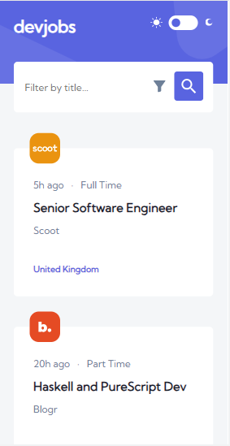
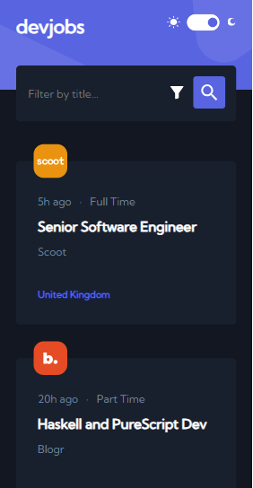
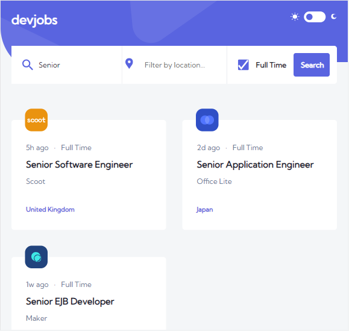
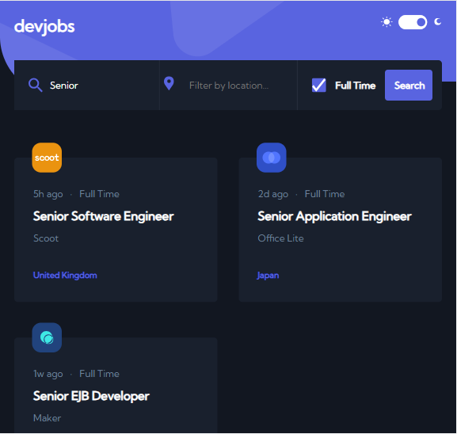
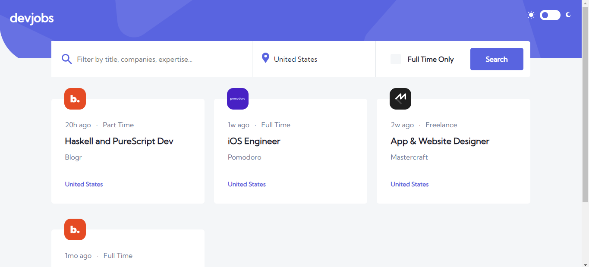
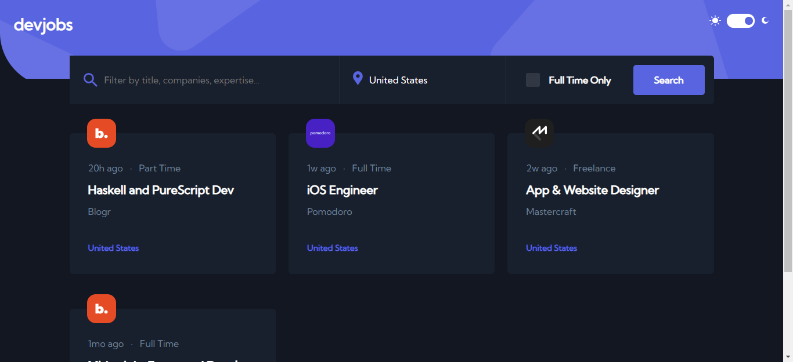

# Frontend Mentor - Devjobs web app solution

This is a solution to the [Devjobs web app challenge on Frontend Mentor](https://www.frontendmentor.io/challenges/devjobs-web-app-HuvC_LP4l). Frontend Mentor challenges help you improve your coding skills by building realistic projects.

Created whit create-react-app.

### Install all dependencies

```
npm install
```

## Start the project

```
npm start
```

## Table of contents

- [Overview](#overview)
  - [The challenge](#the-challenge)
  - [Screenshot](#screenshot)
  - [Links](#links)
- [My process](#my-process)
  - [Built with](#built-with)
  - [Continued development](#continued-development)
  - [Useful resources](#useful-resources)
- [Author](#author)
- [Acknowledgments](#acknowledgments)

## Overview

### The challenge

Users should be able to:

- View the optimal layout for each page depending on their device's screen size
- See hover states for all interactive elements throughout the site
- Be able to filter jobs on the index page by title, location, and whether a job is for a full-time position
- Be able to click a job from the index page so that they can read more information and apply for the job
- **Bonus**: Have the correct color scheme chosen for them based on their computer preferences. _Hint_: Research `prefers-color-scheme` in CSS.

### Screenshot








### Links

- Solution URL: [Code](https://github.com/JimAxl1/DevJobs-web-app)
- Live Site URL: [Demo](https://devjobs-web-app-ea814.web.app)

## My process

### Built with

- Semantic HTML5 markup
- CSS custom properties
- Flexbox
- CSS Grid
- Sass
- Mobile-first workflow
- [React](https://reactjs.org/) - JS library
- React SOLID principles

### Continued development

I would like to improve in code, be a better developer and learn more tools about frontend.

### Useful resources

- [Stack Overflow](https://stackoverflow.com/) - It helped me to solve some problems during the development of the components that included the tag 'input'


## Author

- Frontend Mentor - [@JimAxl1](https://www.frontendmentor.io/profile/JimAxl1)
- Github - [@JimAxl1](https://github.com/JimAxl1)

## Acknowledgments

Coffe and the people of StackOverflow